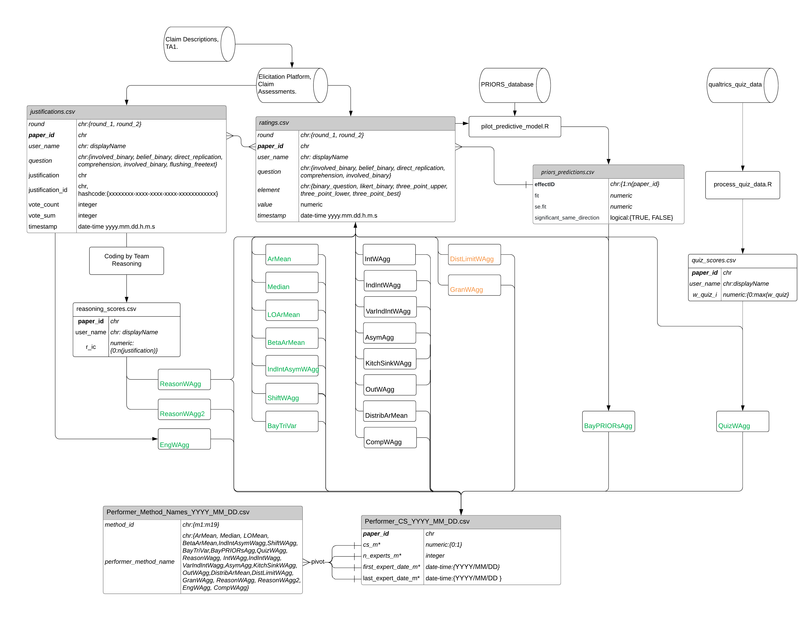

[](https://github.com/metamelb-repliCATS/aggreCAT/actions/workflows/R-CMD-check.yaml)

<!-- README.md is generated from README.Rmd. Please edit that file -->

# Development information

## Aggregation Methods List

## pipeline overview




## installation

``` r
# install this R package


# dependent packages
# install.packages("tidyverse") to install before using library first time
library(tidyverse)
# devtools::install_github("softloud/aggreCAT")
library(aggreCAT)

# ping David for access to the repo
```
