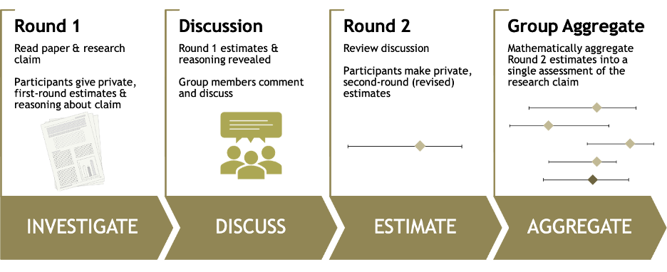
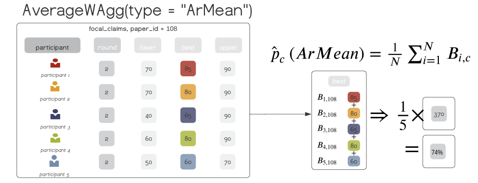

README
================

[](https://zenodo.org/badge/latestdoi/531484296)
[](https://github.com/metamelb-repliCATS/aggreCAT/actions/workflows/R-CMD-check.yaml)

<!-- README.md is generated from README.Rmd. Please edit that file -->

# `aggreCAT`: methods for mathematically aggregating expert judgements

## Problem Context

The use of structured elicitation to inform decision making has grown
dramatically across fields like ecology and environmental science over
the last decade, as researchers and managers are faced with the need to
act rapidly in the face of uncertainty and absent, uninformative data.
However, judgements from multiple experts must be aggregated into a
single estimate or distribution, and empirical evidence suggests that
mathematical aggregation provides more reliable estimates than
behavioural consensus models.

Unfortunately, there is a dearth of accessible tools for implementing
more complex aggregation methods other than linear averages, which are
arguably the most commonly used aggregation method, but may not be the
best approach for yielding robust estimates. The lack of readily
available aggregation methods severely limits users who may want to
utilise alternative aggregation methods more suitable for the task at
hand, but who do not have the time or technical capacity to implement.

The availability of methods implemented in R is even more limited, with
the most fully-fledged [package
`expert`](https://cran.r-project.org/package=expert) being archived from
CRAN in 2022, the [`SHELF`
package](https://cran.r-project.org/package=SHELF) implementing only a
single aggregation method (weighted linear pool / arithmetic mean), and
the [`opera` package](https://cran.r-project.org/package=opera)
aggregating non-point-estimate judgements only (time-series
predictions).

An archived version of `expert` is still available, however, the package
provides only three aggregation methods, and stipulates a structured
elicitation protocol that ‘calibrates’ experts through the use of seed
questions, which are required as additional input data to the
aggregation functions.

## The aggreCAT Package

The `aggreCAT` package aims to fill this void, implementing 22 unique
state-of-the-art and readily deployable methods for mathematically
aggregating expert judgements, described in Hanea et al. (2021).

Aggregation methods comprise unweighted linear combinations of
judgements, weighted linear combinations of judgements where weights are
proxies of forecasting performance constructed from characteristics of
participants and/or their judgements, and, and Bayesian methods that use
expert judgement to update uninformative and informative priors.

Aside from prescribing elicited judgements be derived from any
structured elicitation method that does not force behavioural consensus,
the aggreCAT package does not force users into adhering to one
particular approach to structured expert elicitation. However, some
methods are more prescriptive about input data types and the elicitation
method used to derive them than others. At minimum, a single
point-estimate is required for aggregation, and for some methods,
repliCATS IDEA protocol, is required to generate the necessary data as
inputs to the aggregation function. The IDEA (Investigate, Discuss,
Estimate, Aggregate) protocol generates robust estimates by leveraging
the wisdom-of-the-crowd, and is more onerous than collecting only single
point-estimates, but generates more robust and reliable estimates.

## Installation

You can install:

- the latest development version of `aggreCAT` package:

``` r
install.packages("devtools")
devtools::install_github("metamelb-repliCATS/aggreCAT")
```

- the most recent official version of `aggreCAT` from CRAN:

  - TBC! *We will upload to CRAN once our manuscript (Gould et al. in
    prep.) has been submitted.*

Then load the package:

``` r
library(aggreCAT)
```

# Getting Started with `aggreCAT`

Below we provide a brief summary of the package, for a detailed
overview, please consult the manuscript (Gould et al. in prep.).

## Core Functionality and Design

**Aggregation Functions**

Aggregation methods are grouped based on their mathematical properties
into eight ‘wrapper’ functions, denoted by the suffix `WAgg`, the
abbreviation of “weighted aggregation”: `LinearWAgg()`, `AverageWAgg()`,
`BayesianWAgg()`, `IntervalWAgg()`, `ShiftingWAgg()`, `ReasoningWAgg()`,
`DistributionWAgg()`, and `ExtremisationWAgg()`.

All wrapper functions adhere to the following basic argument structure:

``` r
args(AverageWAgg)
#> function (expert_judgements, type = "ArMean", name = NULL, placeholder = FALSE, 
#>     percent_toggle = FALSE, round_2_filter = TRUE) 
#> NULL
```

- expert judgements are contained a dataframe parsed to
  `expert_judgements`,
- the `type` argument specifies the specific flavour of the wrapper
  aggregation function to be executed on the `expert_judgements` data,
  with the available aggregation methods detailed in each wrapper
  function’s help page, e.g. `?AverageWAgg`,
- `name` allows a user-specified name with which to label the method in
  the results,
- toggling the `placeholder` argument to `TRUE` returns ‘placeholder’
  values, set to $0.65$,
- toggling `percent_toggle` to `TRUE` facilitates aggregating quantities
  rather than probabilities.

Each aggregation wrapper function returns a `dataframe` / `tibble` of
results, with one row or observation per unique judgement task.

**Elicitation Data**

`aggreCAT` includes datasets with judgements about the likely
replicability of research claims, collected by the [repliCATS
project](https://replicats.research.unimelb.edu.au) team as a pilot
study for the [DARPA SCORE
program](https://www.darpa.mil/research/programs/systematizing-confidence-in-open-research-and-evidence).
Data were elicited using a modified version of the IDEA protocol
(Hemming et al. 2017, Figure 1), whereby participants *Investigate*,
*Discuss, Estimate*, and finally *Aggregate* their judgements using
methods from the `aggreCAT` package (Fraser et al. 2021). Following the
IDEA protocol, best estimates, and upper and lower bounds are elicited
from each participant, over two rounds. The judgement data is contained
in the object `data_ratings`, described at `?data_ratings`.

<figure>

<figcaption aria-hidden="true">Figure 1: the repliCATS IDEA protocol was
used to elicit judgements about the likely replicability of research
claims, a pilot version of this dataset is included in the
<code>aggreCAT</code> package</figcaption>
</figure>

## A minimal working example with `AverageWAgg()`

<figure>

<figcaption aria-hidden="true">Figure 2: Mathematically aggregating a
small subset of expert judgements for the claim <code>28</code>, using
the unweighted arithmetic mean. The <code>aggreCAT</code> wrapper
function <code>AverageWAgg()</code> is used on this dataset, with the
<code>type</code> argument set to the default
<code>ArMean</code>.</figcaption>
</figure>

Below we demonstrate how to use the most simple commonly implemented
aggregation method `ArMean`, which takes the arithmetic mean of
participant Best Estimates. We first use a small subset of 5
participants for a single claim, `28`, which is represented visually in
[Figure 1](#fig-1).

``` r
library(dplyr)
data(data_ratings)
set.seed(1234)

participant_subset <- data_ratings %>%
  distinct(user_name) %>%
  sample_n(5) %>%
  mutate(participant_name = paste("participant", rep(1:n())))

single_claim <- data_ratings %>% 
  filter(paper_id == "28") %>% 
  right_join(participant_subset, by = "user_name")

AverageWAgg(expert_judgements = single_claim, 
            type = "ArMean")
#> 
#> ── AverageWAgg: ArMean ─────────────────────────────────────────────────────────
#> 
#> ── Pre-Processing Options ──
#> 
#> ℹ Round Filter: TRUE
#> ℹ Three Point Filter: TRUE
#> ℹ Percent Toggle: FALSE
#> # A tibble: 1 × 4
#>   method paper_id    cs n_experts
#>   <chr>  <chr>    <dbl>     <int>
#> 1 ArMean 28        70.8         5
```

Often times during expert elicitation multiple quantities or measures
are put to experts to provide judgements for, and so we might want to
batch aggregation over more than a single judgement at a time (this time
called without explicitly specifying arguments):

``` r
data_ratings %>% AverageWAgg()
#> 
#> ── AverageWAgg: ArMean ─────────────────────────────────────────────────────────
#> 
#> ── Pre-Processing Options ──
#> 
#> ℹ Round Filter: TRUE
#> ℹ Three Point Filter: TRUE
#> ℹ Percent Toggle: FALSE
#> # A tibble: 25 × 4
#>    method paper_id    cs n_experts
#>    <chr>  <chr>    <dbl>     <int>
#>  1 ArMean 100       70.6        25
#>  2 ArMean 102       30.8        25
#>  3 ArMean 103       62.5        25
#>  4 ArMean 104       47.1        25
#>  5 ArMean 106       36.5        25
#>  6 ArMean 108       71.8        25
#>  7 ArMean 109       72.5        25
#>  8 ArMean 116       62.6        25
#>  9 ArMean 118       54.8        25
#> 10 ArMean 133       59.9        25
#> # … with 15 more rows
```

And other times, we might want to trial different aggregation methods
over those judgements, examining how their mathematical properties might
change the results, for example:

``` r
purrr::map_dfr(.x = list(AverageWAgg, IntervalWAgg, ShiftingWAgg),
                                .f = ~ .x(data_ratings))
```

# Attribution

This research was conducted as a part of the [repliCATS
project](https://replicats.research.unimelb.edu.au), funded by the
[DARPA SCORE
programme](https://www.darpa.mil/research/programs/systematizing-confidence-in-open-research-and-evidence)

The `aggreCAT` package is the culmination of the hard work and
persistence of a small team of researchers. Use of this package shall be
appropriately attributed and cited accordingly:

``` r
citation("aggreCAT")
#> 
#> To cite package 'aggreCAT' in publications use:
#> 
#>   Willcox A, Gray C, Gould E, Wilkinson D, Hanea A, Wintle B, E. O'Dea
#>   R (????). _aggreCAT: Mathematically Aggregating Expert Judgments_. R
#>   package version 0.0.0.9002,
#>   <https://replicats.research.unimelb.edu.au/>.
#> 
#> A BibTeX entry for LaTeX users is
#> 
#>   @Manual{,
#>     title = {aggreCAT: Mathematically Aggregating Expert Judgments},
#>     author = {Aaron Willcox and Charles T. Gray and Elliot Gould and David Wilkinson and Anca Hanea and Bonnie Wintle and Rose {E. O'Dea}},
#>     note = {R package version 0.0.0.9002},
#>     url = {https://replicats.research.unimelb.edu.au/},
#>   }
```

## References

<div id="refs" class="references csl-bib-body hanging-indent">

<div id="ref-Fraser:2021" class="csl-entry">

Fraser, Hannah, Martin Bush, Bonnie Wintle, Fallon Mody, Eden T Smith,
Anca Hanea, Elliot Gould, et al. 2021. “Predicting Reliability Through
Structured Expert Elicitation with repliCATS (Collaborative Assessments
for Trustworthy Science).” MetaArXiv.
<https://doi.org/10.31222/osf.io/2pczv>.

</div>

<div id="ref-Gould2022" class="csl-entry">

Gould, Elliot, Charles T Gray, Aaron Willcox, Rose E O’Dea, Rebecca
Groenewegen, and David P Wilkinson. in prep. “aggreCAT: An r Package for
Mathematically Aggregating Expert Judgments.” MetaArXiv.
<https://doi.org/10.31222/osf.io/74tfv>.

</div>

<div id="ref-Hanea2021" class="csl-entry">

Hanea, Anca, David P Wilkinson, Marissa McBride, Aidan Lyon, Don van
Ravenzwaaij, Felix Singleton Thorn, Charles T Gray, et al. 2021.
“Mathematically Aggregating Experts’ Predictions of Possible Futures.”
*PLoS ONE* 16 (9).
https://doi.org/<https://doi.org/10.1371/journal.pone.0256919>.

</div>

<div id="ref-hemming2017" class="csl-entry">

Hemming, Victoria, Mark A. Burgman, Anca M. Hanea, Marissa F. McBride,
and Bonnie C. Wintle. 2017. “A Practical Guide to Structured Expert
Elicitation Using the IDEA Protocol.” Edited by Barbara Anderson.
*Methods in Ecology and Evolution* 9 (1): 169–80.
<https://doi.org/10.1111/2041-210x.12857>.

</div>

</div>
